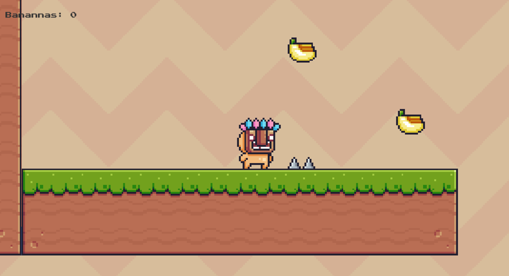
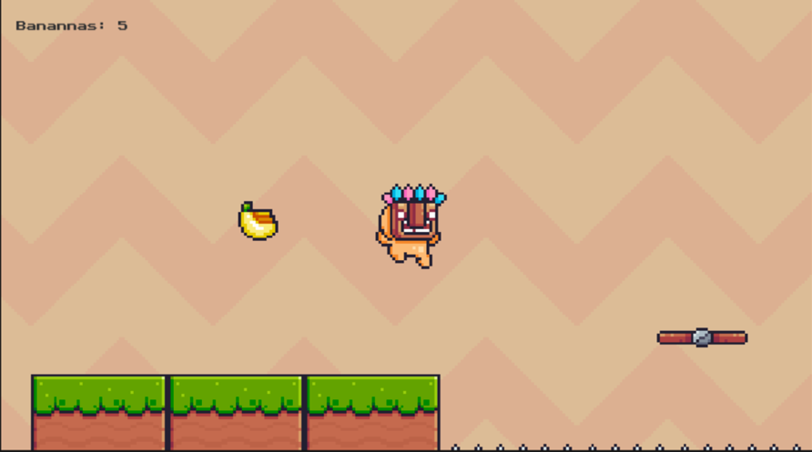
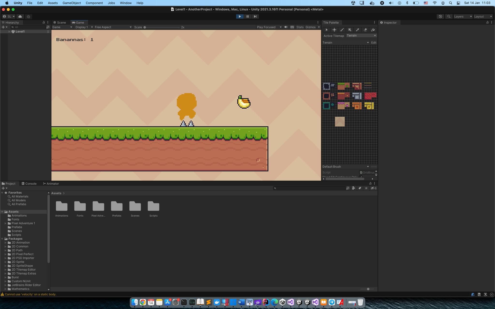
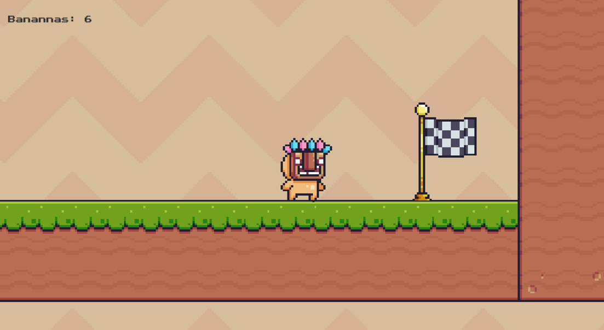

2D Game "Збирач бананів"

Головний персонаж гри - обєкт чоловічка.

- Реалізовано функціонал руху. Анімацію стрибку, падіння, бігу, переходу сторін
- Реалізований функціонал з підрахунку обєктів та вивід на екран
- Також реалізовано смерть персонажу та перехід на старт сцени.
- Є рухомі обєкти у вигляді панелі.
- Кінцевий пракпор закінчання гри

screenshots:

